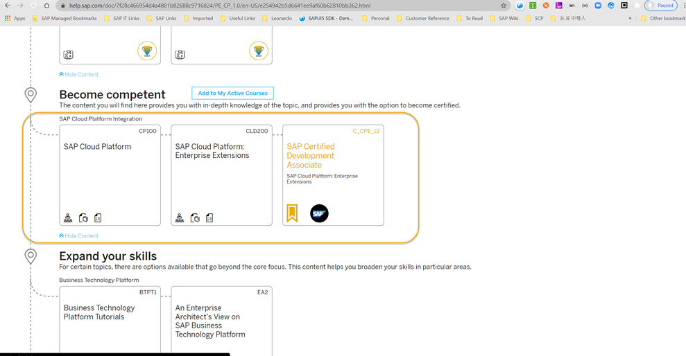

# SAP云平台开发顾问免费蹭课备考攻略
### （有效期：2020-12-01 至 2021-03-31）

**年终岁末将至，又到了一年的休假季，大家共同经历了注定不平凡的2020，面对依旧严峻的疫情，做一个“技术宅”相信会是许多开发顾问的首选休假模式。如何将假期过得更加充实些，作为SAP生态里的一员，获取一个SAP云平台技术顾问认证，无疑将会是最好的新年礼物:gift:，也是对自己技术能力的最佳诠释:muscle:。**

**:bulb:目前，SAP云平台的顾问有2门认证，主要面向SAP云平台集成和SAP云平台扩展开发，大家可以根据自己的需求选择报考：**

:one:SAP云平台集成 - :mortar_board:**C_CPI_13**（SAP Certified Development Associate – SAP Cloud Platform Integration），考试内容基于课程:orange_book:**CP100**和:orange_book:**CLD900**
 

:two:SAP云平台企业扩展 – :mortar_board:**C_CPE_12** （SAP Certified Development Associate – SAP Cloud Platform Enterprise Extensions），考试内容基于:orange_book:**CP100**和:orange_book:**CLD200**
 

**:bulb:随着SAP TechED全球技术大会的顺利召开，SAP展示了众多新的云端开发技术和平台工具，为使生态体系内的开发技术顾问能快速提升技术能力，免费:free:提供了活动版Learning Hub（SAP Learning Hub, Event Edition），里面有21门标准课程的教材:books:，内容涵盖：ABAP开发、SAPUI5开发、SAP Fiori开发、SAP HANA开发建模、SAP云平台集成等。**
 

**:bulb:同时，针对个人账户用户，推出了包含2次考试机会的优惠活动（购买有效期:date:2020-12-01至:date:2020-12-31），购买后12个月内考试完毕。**
 

## :question:如何才能免费获取Learning Hub账号并购买考试机会，你可以按照下面的攻略进行操作：

:point_right: **注册 SAP TechEd 2020 英文会议，与会者可以免费登录 SAP Learning Hub（SAP TechEd 活动版）：SAP Learning Hub, Event Edition2020年12月01日 – 2021年3月31日 更多详情请访问：https://learninghub.sap.com/teched**

:one:点击[“注册 SAP TechEd 全球英文网站”](https://pages.sapteched.com/sap/sapteched2020/index)

:two:点击“SignUp/Login”，如果你已经有SAP云平台账号（Free Trial账号也可以），直接点击“Log On”，否则请点击“Register”（此处默认大家已经申请过）。

:three:点击“CONTINUE”按钮继续

:four:输入所有必填项内容后，点击“CONTINUE”

:five:	点击“CONTINUE”回到主页

:six:恭喜你，注册成功！

:point_right: **打开 SAP Learning Hub, Event Edition（https://learninghub.sap.com/teched）**

:one:	点击“免费登录”

:two:输入称谓，点击“Save and Continue”

:three:进入Learning Hub页面，点击“浏览Learning Room”

:four:接受访问条款

:five:接受个人数据隐私条例条款

:warning:如果遇到下面的错误页面（一般是因为网络访问超时引起的），请换个访问外网比较通畅的时间段（比如第二天早上9点前）

:six:点击“SAP Learning Hub Terms of Use”链接

:seven:点击“Accept”接受Learning Room访问条款

:eight:点击”Learning Content”查看课程库

:point_right: **查找SAP云平台考试相关的教材**

:one:点击“Browse all titles”浏览所有可以访问的课程

:two:点击“Browse by Subject Areas”选择SAP云平台相关课程

:three: 可以看到CP100, CLD200和CLD900的课程电子书教材

:four:	打开相关的电子书，开始你的学习之旅

:point_right: **如果要购买特惠版认证考试（2次机会），需要在:date:2020年12月31日前购买。**

:one:点击Learning Room，进入SAP TechED Learning Room 2020

:two:点击“Learn and Get Certified”，查看特惠考试认证的介绍

:three:点击“Buy Now”进行购买

:four:点击“加入购物篮”进行付款操作，具体的付款过程参考这个链接（https://jam2.sapjam.com/wiki/show/wKuQ8WmxEaqNKTtlCEJJI4?_lightbox=true）

### :trophy:预祝大家学习快乐，顺利考取认证！:trophy:

